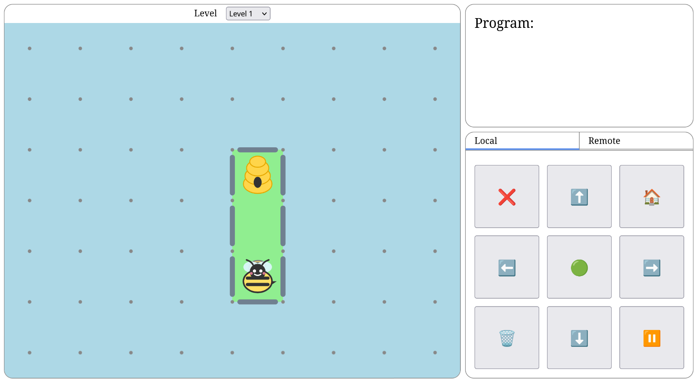
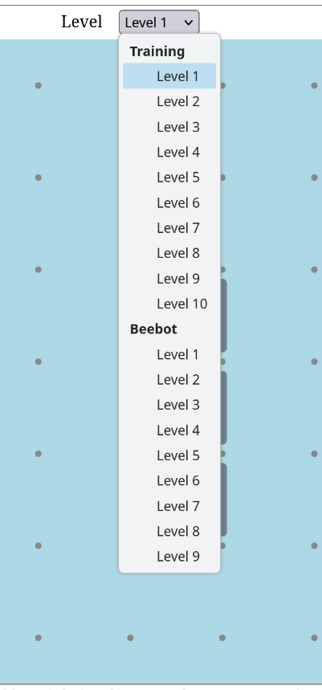
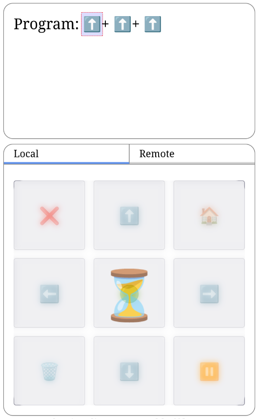
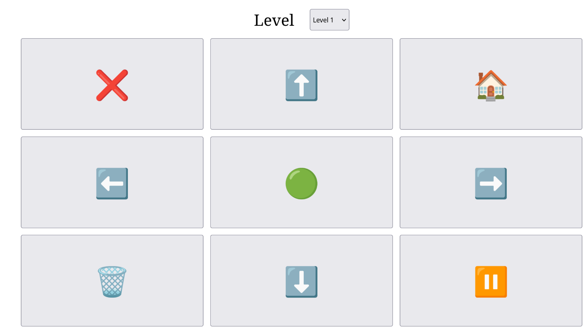

Beebot
======

A kids game where you program a "bee" bot then run it.

Features
--------

- Single shared game with players as controllers of the beebot on screen
- Multiple players can join the game, they all get a control pad
- All web based, only browsers needed
- All peer-to-peer client based state only, no server state (web app served as static files)

Screenshots
-----------

**Host**

Screenshot:



A few levels available:



Control pad and highlighting of current program step when running:



**Remote**



Design
------

- Game state:
    - State
    - Bot
        - Position
            - X: int
            - Y: int
        - Orientation: int
- Game UI:
    - Open space, beebot on screen
- Remote controls UI:
    - Simple buttons

Communication
-------------

1. Load page (/index.html) to act as "host"
2. Give "remote" link to someone, or scan the QR code
3. Remote starts sending commands to host
4. Host continually processes commands, updating and displaying game state

Tech stack
----------

- SPA
- Vanilla JS where possible
    - Reset UI each state change?
    - WebRTC for Host-Remote connection
    - WebSocket signalling for WebRTC negotiation
    - Browser motion API for events
    - Single `main.js` script loaded as module in HTML
    - Other `.js` files imported normally, browser will load
- `qr-code` library (single webcomponent)

Development
-----------

There is no build step but in order to use the browser motion API (currently unused) there's a need to access the client app over HTTPS.  Easiest way to do that is make sure your dev machine announces itself via mDNS (MacOS has bonjour, Linux has avahi) then use "<hostname>.local":

```bash
DUMMY_HOSTNAME=<changethis>.local make server
```
